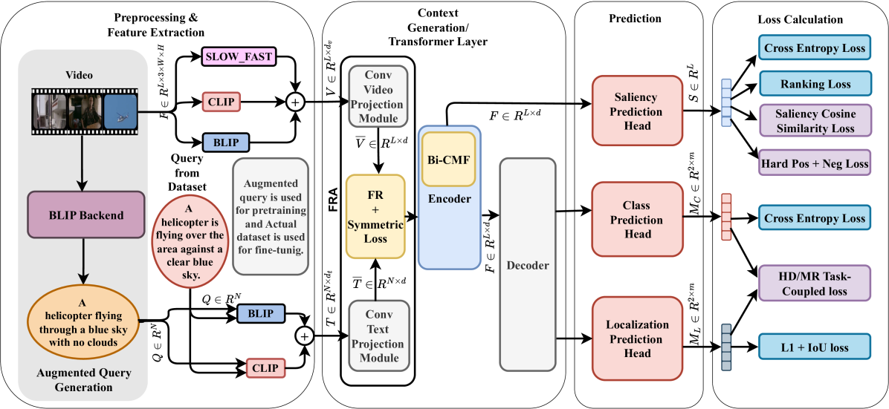

# VideoLights

[](https://arxiv.org/abs/2412.01558)



## Abstract

Video Highlight Detection and Moment Retrieval (HD/MR) are essential in video analysis. Recent joint prediction transformer models often overlook their cross-task dynamics and video-text alignment and refinement. Moreover, most models typically use limited, uni-directional attention mechanisms, resulting in weakly integrated representations and suboptimal performance in capturing the interdependence between video and text modalities. Although large-language and vision-language models (LLM/LVLMs) have gained prominence across various domains, their application in this field remains relatively underexplored. Here we propose VideoLights, a novel HD/MR framework addressing these limitations through (i) Convolutional Projection and Feature Refinement modules with an alignment loss for better video-text feature alignment, (ii) Bi-Directional Cross-Modal Fusion network for strongly coupled query-aware clip representations, and (iii) Uni-directional joint-task feedback mechanism enhancing both tasks through correlation. In addition, (iv) we introduce hard positive/negative losses for adaptive error penalization and improved learning, and (v) leverage LVLMs like BLIP-2 for enhanced multimodal feature integration and intelligent pretraining using synthetic data generated from LVLMs. Comprehensive experiments on QVHighlights, TVSum, and Charades-STA benchmarks demonstrate state-of-the-art performance. Codes and models are available at: https://github.com/dpaul06/VideoLights.


## Getting Started 

### Prerequisites
0. Clone this repo

```
git clone https://github.com/dpaul06/VideoLights.git
cd VideoLights
```

1. Prepare feature files

Download [qvhighlights_features.tar.gz](https://drive.google.com/file/d/1-miy9ylAfaRac6KdjtHj3WYWCgcsjQvC/view?usp=sharing) (11GB), 
extract it under `../Datasets/qvhl/` directory:
```
tar -xf path/to/qvhighlights_features.tar.gz
```
The Slowfast features are extracted using Linjie's [HERO_Video_Feature_Extractor](https://github.com/linjieli222/HERO_Video_Feature_Extractor). Clip and Blip features extraction codes are given with this repo.
If you want to use your own choices of video features, please download the raw videos from this [link](https://nlp.cs.unc.edu/data/jielei/qvh/qvhilights_videos.tar.gz).

2. Install dependencies.

This code requires Python 3.10, PyTorch, and a few other Python libraries. 
We recommend creating conda environment and installing all the dependencies as follows:
```
# create conda env
conda create --name video_lights python=3.10
# activate env
conda actiavte video_lights
# install pytorch with CUDA 12.4
conda install pytorch torchvision torchaudio torchtext cudatoolkit pytorch-cuda=12.4 -c pytorch -c nvidia
# conda install pytorch torchvision torchaudio cudatoolkit -c pytorch
# install all deoendencies
pip install -r requirements.txt

```

### Training on QVHighlights

Training on QVHighlights can be launched by running the following command:
```
bash video_lights/scripts/qvhl/train.sh 
```
This will train VideoLights for 200 epochs on the QVHighlights train split, with SlowFast and Open AI CLIP and Blip2 features. The training is very fast, it can be done within 4 hours using a single RTX 2080Ti GPU. The checkpoints and other experiment log files will be written into `results`. For training under different settings, you can append additional command line flags to the command above. For example, if you want to train the model without the saliency loss (by setting the corresponding loss weight to 0):
```
bash video_lights/scripts/qvhl/train.sh  --lw_saliency 0
```
For more configurable options, please checkout our config file [video_lights/config.py](video_lights/config.py).

### Inference
Once the model is trained, you can use the following command for inference:
```
bash video_lights/scripts/qvhl/inference.sh CHECKPOINT_PATH SPLIT_NAME  
``` 
where `CHECKPOINT_PATH` is the path to the saved checkpoint, `SPLIT_NAME` is the split name for inference, can be one of `val` and `test`.

### Pretraining and Finetuning
VideoLights utilizes synthetic data using Blip for weakly supervised pretraining. download already extracted features `pretrain_features_qc.tar.gz` from this [link](https://drive.google.com/file/d/19I-bVUiMW2bum8ZGUUQVfCOgeBRtcgs-/view?usp=sharing) (27.5GB) and extract them under `../pretrain/` directory

```
mkdir -p ../pretrain
tar -xf path/to/pretrain_features_qc.tar.gz -C ../pretrain
```

To launch pretraining, run:
```
bash video_lights/scripts/pretrain/pretrain_sf_clip_blip.sh  
```  
This will pretrain the VideoLights model on synthetic data for 100 epochs, the pretrained checkpoints and other experiment log files will be written into `results`. With the pretrained checkpoint, we can launch finetuning from a pretrained checkpoint `PRETRAIN_CHECKPOINT_PATH` as:
```
bash video_lights/scripts/qvhl/train.sh  --resume ${PRETRAIN_CHECKPOINT_PATH}
```
Note that this finetuning process is the same as standard training except that it initializes weights from a pretrained checkpoint. 


### Evaluation and Codalab Submission
Please check [standalone_eval/README.md](standalone_eval/README.md) for details.


### Training on TVSum

Download extracted features `tvsum_features.tar.gz` from this [link](https://drive.google.com/file/d/1Uo_qUYbj2oa_J04UZ_rgvePAem4a8LMA/view?usp=sharing)

Extract it under `../Datasets/processed/`
```
mkdir -p ../Datasets/processed/
tar -xf path/to/tvsum_features.tar.gz -C ../Datasets/
```

Training on tvsum can be launched by running the following command:
```
bash video_lights/scripts/tvsum/train.sh
```

### Training on Charades-STA 

Download extracted features `charades-features.tar.gz` from this [link](https://drive.google.com/file/d/1xJ7bE_QL2N7gl-MATteShAgar66ejLxu/view?usp=sharing)

Extract it under `../Datasets/processed/`
```
mkdir -p ../Datasets/processed/
tar -xf path/to/charades-features.tar.gz -C ../Datasets/
```

Training on Charades-STA can be launched by running the following command:
```
bash video_lights/scripts/charades_sta/train.sh   
```

### Train VideoLights on your own dataset
To train VideoLights on your own dataset, please prepare your dataset annotations following the format 
of QVHighlights annotations in [data](./data), and extract features using [HERO_Video_Feature_Extractor](https://github.com/linjieli222/HERO_Video_Feature_Extractor).
Next copy the script [video_lights/scripts/qvhl/train.sh](video_lights/scripts/qvhl/train.sh) and modify the dataset specific parameters 
such as annotation and feature paths. Now you are ready to use this script for training as described in [Training](#training).

## Results and Checkpoints

### Results on QVHighlights test set

| Model | MR |  |  | HD |  | Checkpoints |
| ----- | :---: | :---: | :---: | :---: | :---: | :---: |
|  | R1@0.5 | R1@0.75 | mAP@Avg | mAP | HIT@1 |  |
| VideoLights | 63.36 | 48.7 | 43.38 | 40.57 | 65.3 | [Link](https://drive.google.com/file/d/1psyVph1kNKSKFOxwXjzkeYuO_mbBsLkH/view?usp=drive_link) |
| VideoLights-pt | 68.48 | 52.53 | 45.01 | 41.48 | 65.89 | [Link](https://drive.google.com/file/d/16hb5ndoeg9dEku_lawXE4r-euU9HAluz/view?usp=drive_link) |
| VideoLights-B | 68.29 | 52.79 | 46.53 | 42.43 | 68.94 | [Link](https://drive.google.com/file/d/17OiYKDkGniOYmYHvvqXBSBpx53tvulzv/view?usp=drive_link) |
| VideoLights-B-pt | 70.36 | 55.25 | 47.94 | 42.84 | 70.56 | [Link](https://drive.google.com/file/d/1xLWu7F0OxDO8DW3JOZ3THiOw0FFs1dC-/view?usp=drive_link) |


### Results on Charades-STA

| Model | R@0.3 | R@0.5 | R@0.7 | mIoU | Checkpoints |
| ----- | :---: | :---: | :---: | :---: | :---: |
| VideoLights | 70.67 | 58.04 | 36.88 | 50.2 | [Link](https://drive.google.com/file/d/1aRI5-aEr9wNhl1L6vF7VQt24CL6vLDc0/view?usp=sharing) |
| VideoLights-pt | 72.26 | 60.11 | 37.8 | 51.44 | [Link](https://drive.google.com/file/d/1ZLv9YISAH3qy85T4lIluUT0ObzNW7VAu/view?usp=drive_link) |
| VideoLights-B | 71.72 | 60.3 | 37.23 | 51.25 | [Link](https://drive.google.com/file/d/1fN9_5dytl-kfSAnMciUzKGsSixQt0NvT/view?usp=drive_link) |
| VideoLights-B-pt | 73.33 | 61.96 | 41.05 | 52.94 | [Link](https://drive.google.com/file/d/1DW6IAAkr7doU3yKAxhUkPgi1tK82-bsB/view?usp=drive_link) |


## Acknowledgement
This code is based on [moment-detr](https://github.com/jayleicn/moment_detr), [QD-DETR](https://github.com/wjun0830/QD-DETR), [CG-DETR](https://github.com/wjun0830/CGDETR) [detr](https://github.com/facebookresearch/detr) and [TVRetrieval XML](https://github.com/jayleicn/TVRetrieval). We used resources from [LAVIS](https://github.com/salesforce/LAVIS), [mdetr](https://github.com/ashkamath/mdetr), [MMAction2](https://github.com/open-mmlab/mmaction2), [CLIP](https://github.com/openai/CLIP), [SlowFast](https://github.com/facebookresearch/SlowFast) and [HERO_Video_Feature_Extractor](https://github.com/linjieli222/HERO_Video_Feature_Extractor). We thank the authors for their awesome open-source contributions. 

## Cite this paper

```bibtex
@misc{paul2024videolightsfeaturerefinementcrosstask,
      title={VideoLights: Feature Refinement and Cross-Task Alignment Transformer for Joint Video Highlight Detection and Moment Retrieval}, 
      author={Dhiman Paul and Md Rizwan Parvez and Nabeel Mohammed and Shafin Rahman},
      year={2024},
      eprint={2412.01558},
      archivePrefix={arXiv},
      primaryClass={cs.CV},
      url={https://arxiv.org/abs/2412.01558}, 
}
```

## LICENSE
The annotation files are under [CC BY-NC-SA 4.0](https://creativecommons.org/licenses/by-nc-sa/4.0/) license, see [./data/LICENSE](data/LICENSE). All the code are under [MIT](https://opensource.org/licenses/MIT) license, see [LICENSE](./LICENSE).
 
